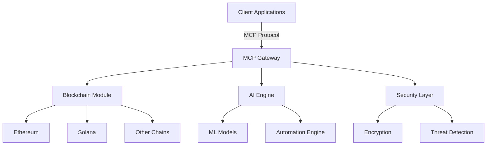

# MCP Servers for Blockchain, AI Automation & Cybersecurity

[](https://opensource.org/licenses/MIT)
[](https://www.python.org/downloads/)
[](https://mcp-servers.readthedocs.io/)

A cutting-edge Model Context Protocol (MCP) server infrastructure designed to power the next generation of decentralized applications with integrated AI automation and enterprise-grade security.

## 🌟 Features

### 🔗 Blockchain Integration
- Multi-chain support for major blockchain networks (Ethereum, Solana, Polygon, etc.)
- Smart contract interaction and deployment automation
- Decentralized identity and access management
- Cross-chain interoperability solutions

### 🤖 AI Automation
- Autonomous smart contract auditing and vulnerability detection
- AI-powered transaction simulation and risk assessment
- Predictive analytics for blockchain operations
- Natural language processing for smart contract interactions

### 🛡️ Cybersecurity
- Zero-trust architecture implementation
- Real-time threat detection and response
- End-to-end encryption for all communications
- Automated security patching and updates

## 🚀 Quick Start

### Prerequisites
- Python 3.8 or higher
- Docker (for containerized deployment)
- Node.js (for some blockchain tooling)

### Installation
```bash
# Clone the repository
git clone https://github.com/yourusername/mcp-servers.git
cd mcp-servers

# Install dependencies
pip install -r requirements.txt

# Set up environment variables
cp .env.example .env
# Edit .env with your configuration

# Start the MCP server
python -m mcp_servers.main
```

## 🏗️ Architecture



## 📚 Documentation

For detailed documentation, please visit our [Documentation Portal](https://mcp-servers.readthedocs.io/).

## 🔧 Configuration

Edit the `config.yaml` file to customize your MCP server settings:

```yaml
server:
  host: 0.0.0.0
  port: 8080
  log_level: INFO

blockchain:
  networks:
    - name: ethereum
      rpc_url: https://mainnet.infura.io/v3/YOUR-PROJECT-ID
    - name: solana
      rpc_url: https://api.mainnet-beta.solana.com

ai:
  model_path: ./models/default
  enable_automation: true
  max_concurrent_tasks: 10

security:
  enable_2fa: true
  rate_limit: 1000
  allowed_origins:
    - https://yourdomain.com
```

## 🤝 Contributing

We welcome contributions! Please read our [Contributing Guidelines](CONTRIBUTING.md) for details on our code of conduct and the process for submitting pull requests.

## 📄 License

This project is licensed under the MIT License - see the [LICENSE](LICENSE) file for details.

## 🌐 Community

Join our community to get help and discuss MCP server development:

- [Discord](https://discord.gg/your-invite-link)
- [Twitter](https://twitter.com/your-handle)
- [GitHub Discussions](https://github.com/yourusername/mcp-servers/discussions)

## 🔍 Roadmap

- [x] Core MCP server implementation
- [ ] Multi-chain support
- [ ] AI-powered security audits
- [ ] Decentralized identity integration
- [ ] Cross-chain bridge automation

## 🙏 Acknowledgments

- All the amazing open-source projects that made this possible
- Our wonderful community of contributors and users

---

Made with ❤️ by [Your Name/Organization]
