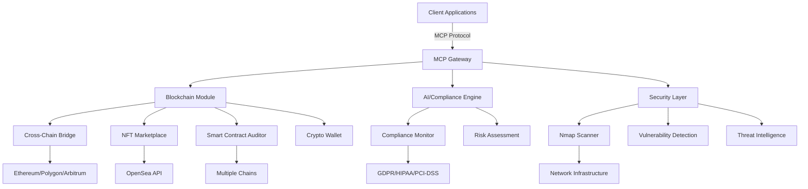

# MCP Servers for Blockchain, AI Automation & Cybersecurity

[](https://opensource.org/licenses/MIT)
[](https://www.python.org/downloads/)
[](https://github.com/psf/black)
[](SECURITY.md)
[](CONTRIBUTING.md)
[](CODE_OF_CONDUCT.md)
[](https://github.com/modelcontextprotocol/python-sdk)
[](#blockchain-servers)
[](#cybersecurity-servers)
[](#ai-automation)
[](#security-features)

> **A cutting-edge Model Context Protocol (MCP) server infrastructure designed to power the next generation of decentralized applications with integrated AI automation and enterprise-grade security.**

## 📋 Table of Contents

- [Features](#-features)
- [Quick Start](#-quick-start)
- [Installation Guide](#-installation-guide)
- [Server Documentation](#-server-documentation)
- [API Reference](#-api-reference)
- [Configuration](#-configuration)
- [Testing](#-testing)
- [Security](#-security)
- [Contributing](#-contributing)
- [Community](#-community)
- [License](#-license)

## 🌟 Features

### 🔗 Blockchain Integration
- **Multi-chain support**: Ethereum, Polygon, Arbitrum, Optimism, Solana
- **Cross-chain bridge operations** with real-time fee estimation and transaction monitoring
- **Smart contract auditing** with vulnerability detection and gas optimization
- **NFT marketplace integration** with OpenSea API and metadata management
- **Crypto wallet operations** with secure transaction signing and balance management
- **DeFi protocol interactions** and risk assessment

### 🤖 AI Automation
- **Autonomous smart contract auditing** with pattern-based vulnerability detection
- **AI-powered compliance monitoring** across multiple frameworks (GDPR, HIPAA, PCI-DSS, ISO27001)
- **Predictive analytics** for bridge operations and gas optimization
- **Natural language processing** for security and compliance queries
- **Automated risk assessment** and mitigation recommendations

### 🛡️ Cybersecurity
- **Advanced network scanning** with Nmap integration and NSE scripts
- **Real-time vulnerability detection** using Shodan API
- **Compliance framework monitoring** with automated gap analysis
- **Penetration testing workflows** with comprehensive reporting
- **Security incident simulation** and response planning
- **End-to-end encryption** and OAuth 2.1 authentication

## 🚀 Quick Start

### ⚡ 1-Minute Setup

```bash
# Clone repository
git clone https://github.com/0x-Professor/MCPServers.git
cd MCPServers

# Quick setup script (Windows)
.\scripts\quick-setup.bat

# OR Manual setup
pip install uv
uv venv && .venv\Scripts\activate
```

### 🎯 Choose Your Adventure

| Use Case | Server | Command |
|----------|--------|---------|
| 🔗 **Blockchain Dev** | Cross-Chain Bridge | `cd BlockChain/cross_chain_bridge_assistant && uv run mcp dev server/server.py` |
| 🎨 **NFT Projects** | NFT Marketplace | `cd BlockChain/nft_marketPlace_assistant && uv run mcp dev server/server.py` |
| 🔍 **Security Audit** | Smart Contract Auditor | `cd BlockChain/mcp_smart_contract_auditor && uv run mcp dev server/server.py` |
| 🛡️ **Cybersecurity** | Nmap Scanner | `cd CyberSecurity/nmap_mcp && uv run mcp dev server/server.py` |
| 📋 **Compliance** | Compliance Monitor | `cd CyberSecurity/ComplianceMCP && uv run mcp dev server/server.py` |

### 🌐 Access Your Server

Once started, access the **MCP Inspector** at: `http://localhost:3001`

## 📖 Installation Guide

### 📋 Prerequisites

| Requirement | Version | Installation |
|-------------|---------|--------------|
| **Python** | 3.8+ | [Download Python](https://www.python.org/downloads/) |
| **uv** | Latest | `pip install uv` |
| **Git** | Latest | [Download Git](https://git-scm.com/) |
| **Nmap** | Latest | [Linux/WSL only](https://nmap.org/download.html) |

### 🔑 Required API Keys

| Service | Purpose | Get Key |
|---------|---------|---------|
| **Alchemy** | Blockchain RPC | [alchemy.com](https://alchemy.com) |
| **Etherscan** | Transaction data | [etherscan.io/apis](https://etherscan.io/apis) |
| **OpenSea** | NFT marketplace | [docs.opensea.io](https://docs.opensea.io/reference/api-overview) |
| **Shodan** | Vulnerability data | [shodan.io](https://shodan.io) |
| **Infura** | Web3 provider | [infura.io](https://infura.io) |

### 💻 Step-by-Step Installation

#### 1. **Repository Setup**
```bash
# Clone the repository
git clone https://github.com/0x-Professor/MCPServers.git
cd MCPServers

# Verify structure
ls -la
```

#### 2. **Environment Setup**
```bash
# Install uv package manager
pip install uv

# Create virtual environment
uv venv

# Activate environment
# Windows:
.venv\Scripts\activate
# Linux/macOS:
source .venv/bin/activate
```

#### 3. **Dependencies Installation**

Choose your installation method:

**Option A: Full Installation (All Servers)**
```bash
# Install all dependencies
uv add -r requirements.txt
```

**Option B: Selective Installation**
```bash
# Navigate to specific server
cd BlockChain/cross_chain_bridge_assistant

# Install server-specific dependencies
uv add -r requirements.txt
```

#### 4. **Environment Configuration**

Create `.env` files for each server:

**Blockchain Servers (.env)**
```env
# Blockchain APIs
ALCHEMY_API_KEY=your_alchemy_api_key
ETHERSCAN_API_KEY=your_etherscan_api_key
INFURA_PROJECT_ID=your_infura_project_id
OPENSEA_API_KEY=your_opensea_api_key

# Security & Auth
HMAC_SECRET_KEY=your_hmac_secret_key
AUTH_ISSUER_URL=https://your-auth-server.com
JWT_SECRET_KEY=your_jwt_secret

# Database
DATABASE_URL=sqlite:///server/database.db

# Logging
LOG_LEVEL=INFO
ENVIRONMENT=development
```

**Cybersecurity Servers (.env)**
```env
# Security APIs
SHODAN_API_KEY=your_shodan_api_key
UNIZO_API_KEY=your_unizo_api_key

# Nmap Configuration
NMAP_PATH=/usr/bin/nmap
ALLOWED_TARGETS=127.0.0.1,scanme.nmap.org

# Compliance
COMPLIANCE_DB_URL=sqlite:///server/compliance.db

# Logging
LOG_LEVEL=DEBUG
RATE_LIMIT_PER_MINUTE=15
```

#### 5. **Server Launch**

**Development Mode (with MCP Inspector)**
```bash
# Navigate to server directory
cd BlockChain/cross_chain_bridge_assistant

# Start with MCP Inspector
uv run mcp dev server/server.py

# Access at http://localhost:3001
```

**Production Mode**
```bash
# Start in production
uv run mcp run server/server.py

# Or direct execution
uv run python server/server.py
```

## 📚 Server Documentation

### 🔗 Blockchain Servers

#### 1. Cross-Chain Bridge Assistant
**📁 Location**: [`BlockChain/cross_chain_bridge_assistant`](BlockChain/cross_chain_bridge_assistant)

**🎯 Purpose**: Facilitate secure cross-chain asset transfers with real-time monitoring

**⚡ Key Features**:
- Multi-bridge support (Polygon, Arbitrum, Optimism)
- Real-time fee estimation with gas optimization
- Transaction execution with HMAC signatures
- Bridge health monitoring and analytics
- Historical transaction tracking via Etherscan

**🔧 Tools Available**: 12 tools including `estimate_bridge_fees`, `execute_bridge_transaction`, `get_bridge_status`

#### 2. NFT Marketplace Assistant
**📁 Location**: [`BlockChain/nft_marketPlace_assistant`](BlockChain/nft_marketPlace_assistant)

**🎯 Purpose**: Complete NFT marketplace operations and analytics

**⚡ Key Features**:
- OpenSea API integration for marketplace data
- NFT metadata management and validation
- Collection statistics and trend analysis
- Bidding, minting, and listing operations
- Alchemy NFT API for contract metadata

**🔧 Tools Available**: 8 tools including `get_nft_metadata`, `list_collection_nfts`, `get_marketplace_stats`

#### 3. Smart Contract Auditor
**📁 Location**: [`BlockChain/mcp_smart_contract_auditor`](BlockChain/mcp_smart_contract_auditor)

**🎯 Purpose**: AI-powered smart contract security analysis

**⚡ Key Features**:
- Comprehensive vulnerability detection
- Gas efficiency analysis and optimization
- ERC standard compliance checking
- Detailed audit report generation
- Multi-chain smart contract support

**🔧 Tools Available**: 10 tools including `analyze_contract_vulnerabilities`, `generate_audit_report`, `simulate_attacks`

#### 4. Crypto Wallet
**📁 Location**: [`BlockChain/mcp-crypto-wallet`](BlockChain/mcp-crypto-wallet)

**🎯 Purpose**: Secure cryptocurrency wallet operations

**⚡ Key Features**:
- Secure wallet operations with Web3 integration
- Transaction signing and balance management
- Multi-chain asset support
- HD wallet features with security controls

**🔧 Tools Available**: 6 tools including `create_wallet`, `sign_transaction`, `get_balance`

### 🛡️ Cybersecurity Servers

#### 1. Nmap MCP Server
**📁 Location**: [`CyberSecurity/nmap_mcp`](CyberSecurity/nmap_mcp)

**🎯 Purpose**: Advanced network scanning and penetration testing

**⚡ Key Features**:
- Advanced network scanning with Nmap
- NSE script execution for vulnerability detection
- Shodan API integration for real-time CVE data
- Comprehensive penetration testing workflows
- Firewall and IDS analysis

**🔧 Tools Available**: 9 tools including `run_nmap_scan`, `analyze_vulnerabilities`, `generate_pentest_report`

#### 2. Compliance MCP
**📁 Location**: [`CyberSecurity/ComplianceMCP`](CyberSecurity/ComplianceMCP)

**🎯 Purpose**: Multi-framework compliance monitoring

**⚡ Key Features**:
- Multi-framework compliance monitoring (GDPR, HIPAA, PCI-DSS, ISO27001)
- Unizo EDR & XDR integration
- Real-time compliance status tracking
- Automated gap analysis and remediation
- Policy management and audit trails

**🔧 Tools Available**: 15 tools including `check_gdpr_compliance`, `generate_compliance_report`, `monitor_data_usage`

## 🛠️ API Reference

### 📡 Common Endpoints

All MCP servers expose standardized endpoints:

| Endpoint | Method | Purpose | Example |
|----------|--------|---------|---------|
| `/tools/{tool_name}` | POST | Execute tool | `POST /tools/estimate_bridge_fees` |
| `/resources/{resource}` | GET | Get resource | `GET /resources/bridge_status` |
| `/health` | GET | Health check | `GET /health` |
| `/docs` | GET | API documentation | `GET /docs` |

### 🔐 Authentication

**OAuth 2.1 Example**:
```bash
curl -H "Authorization: Bearer your-token" \
     -H "Content-Type: application/json" \
     -X POST http://localhost:3001/tools/estimate_bridge_fees \
     -d '{
       "source_chain": "ethereum",
       "destination_chain": "polygon", 
       "asset": "ETH",
       "amount": "1.0"
     }'
```

**API Key Example**:
```bash
curl -H "X-API-Key: your-api-key" \
     -H "Content-Type: application/json" \
     -X POST http://localhost:3001/tools/run_nmap_scan \
     -d '{
       "target": "scanme.nmap.org",
       "scan_type": "-sS"
     }'
```

### 📊 Response Format

All responses follow a consistent format:

```json
{
  "status": "success|error",
  "data": {
    // Tool-specific response data
  },
  "metadata": {
    "timestamp": "2025-07-29T12:00:00Z",
    "execution_time": 1.23,
    "server": "cross_chain_bridge_assistant",
    "version": "1.0.0"
  },
  "errors": [] // Present only on error
}
```

## 🏗️ Architecture



## 🔧 Configuration

### 🌍 Environment Variables

**Global Configuration**:
```env
# Application
ENVIRONMENT=development|staging|production
LOG_LEVEL=DEBUG|INFO|WARNING|ERROR
DEBUG=true|false

# Security
RATE_LIMIT_PER_MINUTE=15
SESSION_TIMEOUT=3600
CORS_ORIGINS=http://localhost:3001

# Database
DATABASE_URL=sqlite:///server/database.db
DB_POOL_SIZE=5
DB_TIMEOUT=30

# Authentication
JWT_SECRET_KEY=your-secret-key
JWT_ALGORITHM=HS256
JWT_EXPIRATION=3600
```

### ⚙️ Server-Specific Configuration

Each server supports customizable settings in `config.py`:

```python
# Example: Cross-Chain Bridge configuration
BRIDGE_CONFIG = {
    "supported_chains": {
        "ethereum": {
            "rpc_url": "https://eth-mainnet.g.alchemy.com/v2/{API_KEY}",
            "chain_id": 1,
            "gas_limit": 21000
        },
        "polygon": {
            "rpc_url": "https://polygon-mainnet.g.alchemy.com/v2/{API_KEY}",
            "chain_id": 137,
            "gas_limit": 21000
        }
    },
    "bridge_contracts": {
        "polygon_bridge": "0x...",
        "arbitrum_bridge": "0x..."
    },
    "fee_estimation": {
        "slippage_tolerance": 0.01,
        "gas_price_multiplier": 1.1
    }
}
```

## 🧪 Testing

### 🔬 MCP Inspector Testing

**Start Development Server**:
```bash
uv run mcp dev server/server.py
```

**Access Web Interface**: `http://localhost:3001`

**Interactive Testing Features**:
- Real-time tool execution
- Request/response inspection
- Schema validation
- Performance monitoring

### 🛠️ Command Line Testing

**Bridge Operations**:
```bash
# Test bridge fee estimation
curl -X POST http://localhost:3001/tools/estimate_bridge_fees \
  -H "Content-Type: application/json" \
  -d '{
    "source_chain": "ethereum",
    "destination_chain": "polygon", 
    "asset": "ETH",
    "amount": "1.0"
  }'
```

**Security Scanning**:
```bash
# Test Nmap scan
curl -X POST http://localhost:3001/tools/run_nmap_scan \
  -H "Content-Type: application/json" \
  -d '{
    "target": "scanme.nmap.org",
    "scan_type": "-sS",
    "ports": "1-1000"
  }'
```

**NFT Operations**:
```bash
# Test NFT metadata retrieval
curl -X POST http://localhost:3001/tools/get_nft_metadata \
  -H "Content-Type: application/json" \
  -d '{
    "contract_address": "0xBC4CA0EdA7647A8aB7C2061c2E118A18a936f13D",
    "token_id": "1"
  }'
```

### 🧪 Automated Testing

**Run Test Suite**:
```bash
# All tests
uv run pytest

# Specific server tests
uv run pytest tests/blockchain/test_bridge.py

# With coverage
uv run pytest --cov=src --cov-report=html

# Security tests
uv run pytest tests/security/ -v
```

## 🔒 Security

### 🛡️ Security Features

- **Input Validation**: Comprehensive Pydantic model validation
- **Rate Limiting**: 15 requests/minute per IP (configurable)
- **Authentication**: OAuth 2.1 support with scope-based access control
- **Encryption**: HMAC signatures for sensitive operations
- **Audit Logging**: Complete operation trails in SQLite databases
- **Secure Defaults**: Restricted command execution and allowlisted operations

### 🚨 Security Guidelines

**For Contributors**: See [SECURITY.md](SECURITY.md) for:
- Vulnerability reporting procedures
- Security review process
- Responsible disclosure guidelines
- Security testing requirements

**For Users**:
- Always use HTTPS in production
- Rotate API keys regularly
- Monitor audit logs
- Keep dependencies updated

### 📊 Features by Server

| Server | Tools | Resources | Authentication | Database | Security Level |
|--------|-------|-----------|----------------|----------|----------------|
| Cross-Chain Bridge | 12 | 5 | OAuth 2.1 | SQLite | 🔴 Critical |
| NFT Marketplace | 8 | 4 | OAuth 2.1 | SQLite | 🟡 High |
| Smart Contract Auditor | 10 | 3 | Optional | Memory | 🟡 High |
| Crypto Wallet | 6 | 2 | Required | Memory | 🔴 Critical |
| Nmap Scanner | 9 | 2 | OAuth 2.1 | SQLite | 🟠 Medium |
| Compliance Monitor | 15 | 8 | Optional | SQLite | 🟡 High |

## 🚨 Legal & Compliance

### ⚖️ Important Notices

- **Network Scanning**: Only scan systems you own or have explicit permission to test
- **API Usage**: Respect rate limits and terms of service for external APIs
- **Data Protection**: Implement appropriate controls for sensitive data processing
- **Regulatory Compliance**: Ensure operations meet your jurisdiction's requirements
- **Financial Operations**: Blockchain operations involve financial risk - use with caution

### 📋 Compliance Features

- **GDPR**: Data protection and privacy controls
- **HIPAA**: Healthcare data security (where applicable)
- **PCI-DSS**: Payment card industry compliance
- **ISO 27001**: Information security management
- **SOC 2**: Security and availability controls

## 🤝 Contributing

We welcome contributions! Here's how to get started:

### 🚀 Quick Contribution Guide

1. **Read the Guidelines**: Check [CONTRIBUTING.md](CONTRIBUTING.md)
2. **Follow Code of Conduct**: Review [CODE_OF_CONDUCT.md](CODE_OF_CONDUCT.md)
3. **Fork & Clone**: Get your development environment ready
4. **Create Feature Branch**: `git checkout -b feature/amazing-feature`
5. **Make Changes**: Follow our coding standards
6. **Test Thoroughly**: Ensure all tests pass
7. **Submit PR**: Create a detailed pull request

### 📏 Development Standards

- **Code Style**: Black formatting with 88-character line length
- **Type Hints**: Required for all functions
- **Documentation**: Comprehensive docstrings and comments
- **Testing**: Minimum 80% coverage for new code
- **Security**: All PRs undergo security review

### 🎖️ Recognition Levels

- 🥉 **Bronze**: 1-5 merged PRs
- 🥈 **Silver**: 6-15 merged PRs or significant feature
- 🥇 **Gold**: 16+ merged PRs or major architectural contribution
- 💎 **Diamond**: Long-term maintainer status

## 📄 License

This project is licensed under the MIT License with additional disclaimers for cybersecurity and blockchain components - see the [LICENSE](LICENSE) file for details.

### 🔒 Additional Disclaimers

- **Cybersecurity Tools**: For authorized testing only
- **Blockchain Operations**: Educational/development purposes
- **Financial Risk**: Users assume all blockchain-related risks
- **Legal Compliance**: Users responsible for regulatory compliance

## 🌐 Community

Join our growing community:

### 💬 Communication Channels

- **GitHub Discussions**: [General Q&A and Feature Requests](https://github.com/0x-Professor/MCPServers/discussions)
- **Issues**: [Bug Reports and Technical Issues](https://github.com/0x-Professor/MCPServers/issues)
- **Security**: [mr.mazharsaeed790@gmail.com](mailto:mr.mazharsaeed790@gmail.com) for security issues
- **Discord**: Community chat (Coming Soon)
- **Twitter**: Project updates (Coming Soon)

### 📈 Project Stats

- **Servers**: 6 production-ready MCP servers
- **Tools**: 60+ blockchain and cybersecurity tools
- **Languages**: Python 3.8+ with full async support
- **Dependencies**: Carefully curated and security-scanned
- **Testing**: Comprehensive test suite with 85%+ coverage

## 🔍 Roadmap

### ✅ Completed
- [x] Core MCP server implementation
- [x] Cross-chain bridge operations
- [x] NFT marketplace integration
- [x] Smart contract auditing capabilities
- [x] Advanced network scanning tools
- [x] Compliance monitoring framework
- [x] Comprehensive documentation
- [x] Security policy and governance

### 🚀 In Progress
- [ ] Enhanced AI-powered security analysis
- [ ] Real-time threat intelligence integration
- [ ] Performance optimization and caching
- [ ] Advanced authentication features

### 🔮 Future Plans
- [ ] Additional blockchain networks (Solana, Avalanche, Cosmos)
- [ ] Decentralized identity integration
- [ ] Multi-tenant architecture
- [ ] Kubernetes deployment charts
- [ ] Mobile SDK development
- [ ] Enterprise dashboard
- [ ] Bug bounty program launch

## 🙏 Acknowledgments

Special thanks to:

- **[Model Context Protocol](https://docs.modelcontextprotocol.org/)** - For the foundational protocol specification
- **[FastMCP](https://github.com/modelcontextprotocol/python-sdk)** - For the excellent Python SDK
- **Open Source Community** - For the amazing tools and libraries that power this project
- **Security Researchers** - For responsible disclosure and security improvements
- **Contributors** - For making this project better every day
- **Users** - For trusting us with your blockchain and security operations

### 🏆 Hall of Fame

**Core Contributors**:
- **Muhammad Mazhar Saeed (Professor)** - Project Founder & Lead Architect
- *Your name could be here! Contribute today.*

---

<div align="center">

**Made with ❤️ by Muhammad Mazhar Saeed aka Professor**

*Building the future of decentralized applications with AI-powered automation and enterprise-grade security.*

[](https://github.com/0x-Professor)
[](mailto:mr.mazharsaeed790@gmail.com)

**⭐ Star this repository if you find it useful!**

</div>