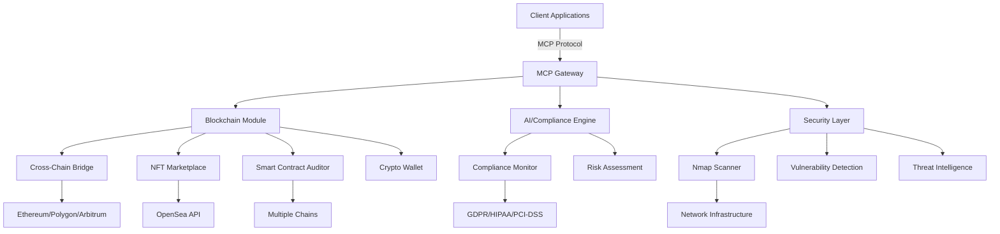

# MCP Servers for Blockchain, AI Automation & Cybersecurity

[](https://opensource.org/licenses/MIT)
[](https://www.python.org/downloads/)
[](https://mcp-servers.readthedocs.io/)

A cutting-edge Model Context Protocol (MCP) server infrastructure designed to power the next generation of decentralized applications with integrated AI automation and enterprise-grade security.

## 🌟 Features

### 🔗 Blockchain Integration
- **Multi-chain support**: Ethereum, Polygon, Arbitrum, Optimism, Solana
- **Cross-chain bridge operations** with real-time fee estimation and transaction monitoring
- **Smart contract auditing** with vulnerability detection and gas optimization
- **NFT marketplace integration** with OpenSea API and metadata management
- **Crypto wallet operations** with secure transaction signing and balance management
- **DeFi protocol interactions** and risk assessment

### 🤖 AI Automation
- **Autonomous smart contract auditing** with pattern-based vulnerability detection
- **AI-powered compliance monitoring** across multiple frameworks (GDPR, HIPAA, PCI-DSS, ISO27001)
- **Predictive analytics** for bridge operations and gas optimization
- **Natural language processing** for security and compliance queries
- **Automated risk assessment** and mitigation recommendations

### 🛡️ Cybersecurity
- **Advanced network scanning** with Nmap integration and NSE scripts
- **Real-time vulnerability detection** using Shodan API
- **Compliance framework monitoring** with automated gap analysis
- **Penetration testing workflows** with comprehensive reporting
- **Security incident simulation** and response planning
- **End-to-end encryption** and OAuth 2.1 authentication

## 🏗️ MCP Servers Overview

### Blockchain Servers

#### 1. Cross-Chain Bridge Assistant
**Location**: [`BlockChain/cross_chain_bridge_assistant`](BlockChain/cross_chain_bridge_assistant)
- Multi-bridge support (Polygon, Arbitrum, Optimism)
- Real-time fee estimation with gas optimization
- Transaction execution with HMAC signatures
- Bridge health monitoring and analytics
- Historical transaction tracking via Etherscan

#### 2. NFT Marketplace Assistant
**Location**: [`BlockChain/nft_marketPlace_assistant`](BlockChain/nft_marketPlace_assistant)
- OpenSea API integration for marketplace data
- NFT metadata management and validation
- Collection statistics and trend analysis
- Bidding, minting, and listing operations
- Alchemy NFT API for contract metadata

#### 3. Smart Contract Auditor
**Location**: [`BlockChain/mcp_smart_contract_auditor`](BlockChain/mcp_smart_contract_auditor)
- Comprehensive vulnerability detection
- Gas efficiency analysis and optimization
- ERC standard compliance checking
- Detailed audit report generation
- Multi-chain smart contract support

#### 4. Crypto Wallet
**Location**: [`BlockChain/mcp-crypto-wallet`](BlockChain/mcp-crypto-wallet)
- Secure wallet operations with Web3 integration
- Transaction signing and balance management
- Multi-chain asset support
- HD wallet features with security controls

### Cybersecurity Servers

#### 1. Nmap MCP Server
**Location**: [`CyberSecurity/nmap_mcp`](CyberSecurity/nmap_mcp)
- Advanced network scanning with Nmap
- NSE script execution for vulnerability detection
- Shodan API integration for real-time CVE data
- Comprehensive penetration testing workflows
- Firewall and IDS analysis

#### 2. Compliance MCP
**Location**: [`CyberSecurity/ComplianceMCP`](CyberSecurity/ComplianceMCP)
- Multi-framework compliance monitoring (GDPR, HIPAA, PCI-DSS, ISO27001)
- Unizo EDR & XDR integration
- Real-time compliance status tracking
- Automated gap analysis and remediation
- Policy management and audit trails

## 🚀 Quick Start

### Prerequisites
- Python 3.8 or higher
- `uv` package manager (recommended)
- Docker (optional, for containerized deployment)
- API keys for external services (Alchemy, OpenSea, Shodan, etc.)

### Installation

1. **Clone the repository**
   ```bash
   git clone https://github.com/0x-Professor/MCPServers.git
   cd MCPServers
   ```

2. **Set up environment**
   ```bash
   # Install uv if not already installed
   pip install uv
   
   # Create virtual environment
   uv venv
   
   # Activate virtual environment (Windows)
   .venv\Scripts\activate
   ```

3. **Install dependencies**
   ```bash
   # For specific servers, navigate to the server directory
   cd BlockChain/cross_chain_bridge_assistant
   uv add "mcp[cli]>=0.1.2" web3>=6.0.0 pydantic>=2.0.0
   
   # Or install all dependencies
   uv add -r requirements.txt
   ```

4. **Configure environment variables**
   ```bash
   # Copy example .env file
   cp .env.example .env
   
   # Edit .env with your API keys and configuration
   # Required: ALCHEMY_API_KEY, ETHERSCAN_API_KEY, SHODAN_API_KEY, etc.
   ```

5. **Start an MCP server**
   ```bash
   # Development mode with MCP Inspector
   uv run mcp dev server/server.py
   
   # Production mode
   uv run mcp run server/server.py
   
   # Direct execution
   uv run python server/server.py
   ```

### Server-Specific Setup

#### Cross-Chain Bridge Assistant
```bash
cd BlockChain/cross_chain_bridge_assistant
uv add web3>=6.0.0 aiohttp>=3.8.6 cachetools>=5.0.0
uv run mcp dev server/server.py
# Access at http://localhost:3001
```

#### Nmap MCP Server
```bash
cd CyberSecurity/nmap_mcp
# Install Nmap (Linux/WSL)
sudo apt update && sudo apt install nmap -y
uv add python-libnmap>=0.7.3 shodan>=1.31.0
uv run mcp dev server/server.py
```

#### Compliance MCP
```bash
cd CyberSecurity/ComplianceMCP
uv add aiohttp>=3.8.6 shodan>=1.31.0
uv run mcp dev server/server.py
```

## 🛠️ API Documentation

Each MCP server exposes tools, resources, and prompts via HTTP endpoints:

### Common Endpoints
- **Tools**: `POST /{server_name}/{tool_name}`
- **Resources**: `GET /{server_name}/resources/{resource_name}`
- **Health Check**: `GET /{server_name}/health`

### Authentication
Most servers support OAuth 2.1 authentication:
```bash
curl -H "Authorization: Bearer your-token" \
     -H "Content-Type: application/json" \
     -X POST http://localhost:3001/server/tool_name \
     -d '{"param": "value"}'
```

## 🏗️ Architecture



## 🔧 Configuration

### Environment Variables

Create a `.env` file in each server directory:

```env
# Blockchain APIs
ALCHEMY_API_KEY=your_alchemy_key
ETHERSCAN_API_KEY=your_etherscan_key
INFURA_PROJECT_ID=your_infura_id
OPENSEA_API_KEY=your_opensea_key

# Security APIs
SHODAN_API_KEY=your_shodan_key
UNIZO_API_KEY=your_unizo_key

# Authentication
AUTH_ISSUER_URL=https://your-auth-server.com
AUTH_SERVER_URL=https://your-resource-server.com

# Database
DATABASE_URL=sqlite:///server/database.db

# Logging
LOG_LEVEL=INFO
```

### Server Configuration

Each server supports customizable settings:

```python
# Example: Cross-Chain Bridge configuration
SUPPORTED_CHAINS = {
    "ethereum": {"rpc_url": "https://eth-mainnet.g.alchemy.com/v2/API_KEY"},
    "polygon": {"rpc_url": "https://polygon-mainnet.g.alchemy.com/v2/API_KEY"},
    "arbitrum": {"rpc_url": "https://arb-mainnet.g.alchemy.com/v2/API_KEY"}
}
```

## 🧪 Testing

### Using MCP Inspector
```bash
# Start server in development mode
uv run mcp dev server/server.py

# Access web interface at http://localhost:3001
# Test tools interactively through the UI
```

### Using curl
```bash
# Test cross-chain bridge fee estimation
curl -X POST http://localhost:3001/bridge/estimate_bridge_fees \
  -H "Content-Type: application/json" \
  -d '{
    "source_chain": "ethereum",
    "destination_chain": "polygon", 
    "asset": "ETH",
    "amount": "1.0"
  }'

# Test Nmap scan
curl -X POST http://localhost:3001/cyber/run_nmap_scan \
  -H "Content-Type: application/json" \
  -d '{
    "target": "scanme.nmap.org",
    "scan_type": "-sS"
  }'
```

## 📊 Features by Server

| Server | Tools | Resources | Authentication | Database |
|--------|-------|-----------|----------------|----------|
| Cross-Chain Bridge | 12 | 5 | OAuth 2.1 | SQLite |
| NFT Marketplace | 8 | 4 | OAuth 2.1 | SQLite |
| Smart Contract Auditor | 10 | 3 | Optional | Memory |
| Crypto Wallet | 6 | 2 | Required | Memory |
| Nmap Scanner | 9 | 2 | OAuth 2.1 | SQLite |
| Compliance Monitor | 15 | 8 | Optional | SQLite |

## 🔒 Security Features

- **Input Validation**: Comprehensive Pydantic model validation
- **Rate Limiting**: 15 requests/minute per IP (configurable)
- **Authentication**: OAuth 2.1 support with scope-based access control
- **Encryption**: HMAC signatures for sensitive operations
- **Audit Logging**: Complete operation trails in SQLite databases
- **Secure Defaults**: Restricted command execution and allowlisted operations

## 🚨 Legal & Compliance

- **Network Scanning**: Only scan systems you own or have permission to test
- **API Usage**: Respect rate limits and terms of service for external APIs
- **Data Protection**: Implement appropriate controls for sensitive data
- **Compliance**: Ensure operations meet your regulatory requirements

## 🤝 Contributing

We welcome contributions! Please follow these steps:

1. Fork the repository
2. Create a feature branch (`git checkout -b feature/new-server`)
3. Follow the coding standards (Black formatting, type hints)
4. Add comprehensive tests and documentation
5. Submit a pull request

### Development Guidelines

- Use Pydantic models for all input/output validation
- Implement proper error handling and logging
- Follow MCP protocol specifications
- Include comprehensive docstrings and type hints
- Add unit tests for critical functionality

## 📄 License

This project is licensed under the MIT License - see the [LICENSE](LICENSE) file for details.

## 🌐 Community

Join our community for support and discussions:

- [GitHub Discussions](https://github.com/0x-Professor/MCPServers/discussions)
- [Discord](https://discord.gg/your-invite-link) - Coming Soon
- [Twitter](https://twitter.com/your-handle) - Coming Soon

## 🔍 Roadmap

- [x] Core MCP server implementation
- [x] Cross-chain bridge operations
- [x] NFT marketplace integration
- [x] Smart contract auditing
- [x] Advanced network scanning
- [x] Compliance monitoring
- [ ] Additional blockchain networks (Solana, Avalanche)
- [ ] Advanced AI-powered security analysis
- [ ] Decentralized identity integration
- [ ] Real-time threat intelligence feeds
- [ ] Multi-tenant architecture
- [ ] Kubernetes deployment charts

## 🙏 Acknowledgments

- [Model Context Protocol](https://docs.modelcontextprotocol.org/) for the foundational protocol
- [FastMCP](https://github.com/modelcontextprotocol/python-sdk) for the Python SDK
- All the amazing open-source projects that made this possible
- Our wonderful community of contributors and users

---

**Made with ❤️ by Muhammad Mazhar Saeed aka Professor**

*Building the future of decentralized applications with AI-powered automation and enterprise-grade security.*