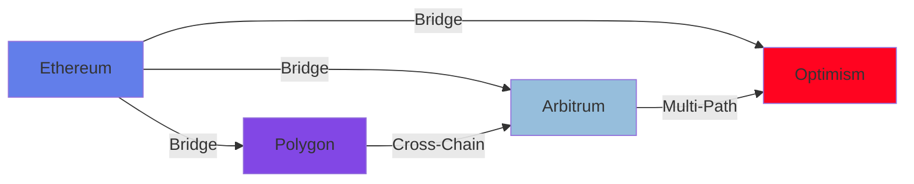
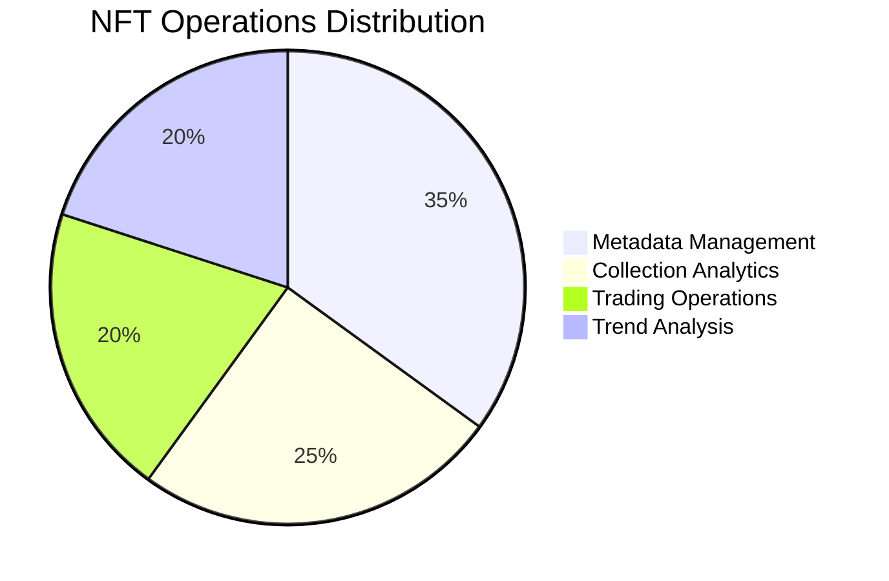
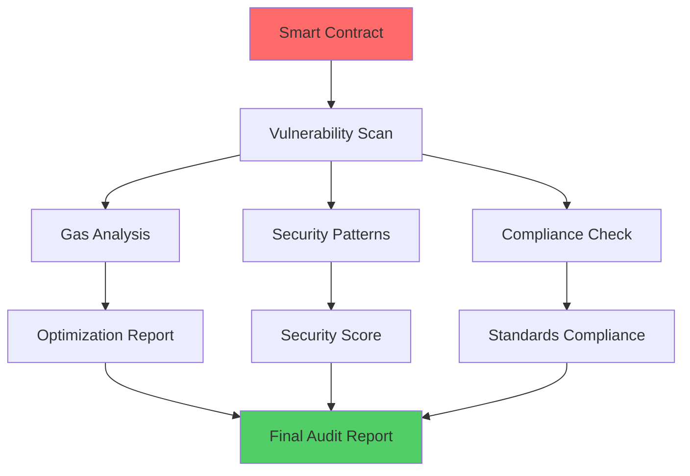
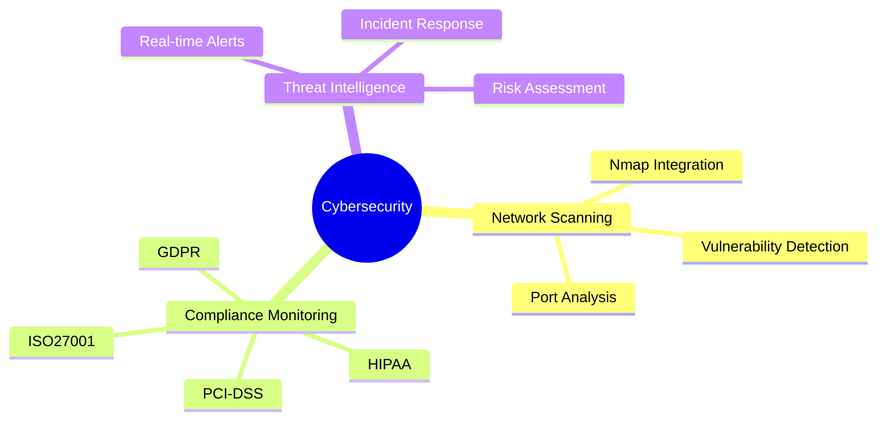
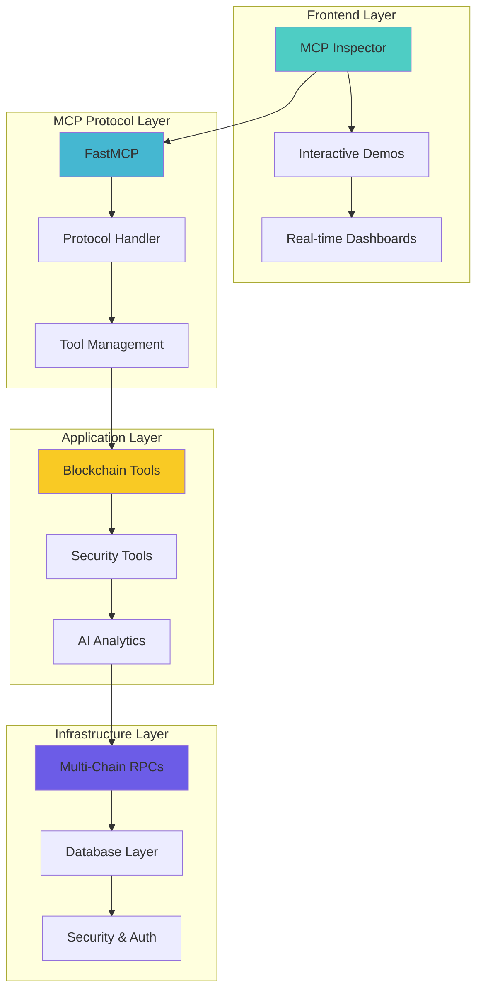

# 🚀 Project Portfolio & Innovation Timeline

<div align="center">


</div>

## 🌟 Innovation Journey

### 🎯 2025: MCP Server Infrastructure Revolution
> **The Beginning of a New Era in Decentralized Computing**

**🔧 MCP Server Infrastructure** - *AI & Blockchain Automation*
- Revolutionary Model Context Protocol implementation
- Multi-chain blockchain integration (Ethereum, Polygon, Arbitrum, Optimism)
- AI-powered automation and security analysis
- Enterprise-grade cybersecurity tools
- Real-time cross-chain bridge operations
- Advanced smart contract auditing capabilities

**Key Achievements:**
- ✅ 6 Production-ready MCP servers
- ✅ 60+ Blockchain and cybersecurity tools
- ✅ Multi-chain support with real-time monitoring
- ✅ AI-powered vulnerability detection
- ✅ Enterprise-grade security implementation

---

## 🔗 Featured Projects & Demonstrations

### 1. 🌉 Cross-Chain Bridge Assistant
**Live Demo**: [Interactive Bridge Operations](../BlockChain/cross_chain_bridge_assistant)



**Features:**
- Real-time fee estimation with gas optimization
- Secure transaction execution with HMAC signatures
- Multi-bridge support with health monitoring
- Historical transaction tracking

### 2. 🎨 NFT Marketplace Assistant
**Live Demo**: [NFT Operations Showcase](../BlockChain/nft_marketPlace_assistant)



**Features:**
- OpenSea API integration
- Advanced metadata management
- Real-time market analytics
- Automated listing and bidding

### 3. 🔍 Smart Contract Auditor
**Live Demo**: [Security Analysis Tools](../BlockChain/mcp_smart_contract_auditor)



**Features:**
- AI-powered vulnerability detection
- Gas efficiency optimization
- ERC standard compliance
- Comprehensive audit reporting

### 4. 🛡️ Cybersecurity Suite
**Live Demo**: [Security Tools Dashboard](../CyberSecurity)



**Features:**
- Advanced network scanning with Nmap
- Multi-framework compliance monitoring
- Real-time threat intelligence
- Automated security assessments

---

## 🎮 Interactive Demos

### 🚀 Quick Start Demo
```bash
# Experience our flagship Cross-Chain Bridge
cd BlockChain/cross_chain_bridge_assistant
uv run mcp dev server/server.py

# Access the interactive demo at http://localhost:3001
```

### 🎯 Try Our Tools
| Demo | Command | Description |
|------|---------|-------------|
| 🌉 **Bridge Demo** | `uv run demo_bridge.py` | Interactive cross-chain operations |
| 🎨 **NFT Explorer** | `uv run demo_nft.py` | NFT marketplace interactions |
| 🔍 **Security Scan** | `uv run demo_security.py` | Live security assessment |
| 🛡️ **Compliance Check** | `uv run demo_compliance.py` | Regulatory compliance tools |

---

## 🎨 Technology Stack

<div align="center">



</div>

---

## 🏆 Innovation Highlights

### 🌟 What Makes This Special

#### 🚀 **Cutting-Edge Protocol Implementation**
- First comprehensive MCP server suite for blockchain operations
- Revolutionary approach to decentralized application development
- Seamless integration between AI, blockchain, and security

#### 🔐 **Enterprise-Grade Security**
- OAuth 2.1 authentication with scope-based access control
- HMAC signatures for sensitive operations
- Comprehensive audit logging and monitoring
- Multi-framework compliance support

#### 🤖 **AI-Powered Automation**
- Intelligent vulnerability detection
- Predictive analytics for bridge operations
- Automated compliance monitoring
- Smart contract optimization

#### 🌍 **Multi-Chain Excellence**
- Ethereum, Polygon, Arbitrum, Optimism support
- Real-time cross-chain monitoring
- Unified API for all blockchain interactions
- Advanced fee optimization algorithms

---

## 📊 Project Statistics

<div align="center">

| Metric | Value | Status |
|--------|-------|---------|
| **MCP Servers** | 6 | 🟢 Production Ready |
| **Blockchain Tools** | 40+ | 🟢 Active |
| **Security Tools** | 20+ | 🟢 Deployed |
| **Supported Chains** | 4+ | 🟢 Multi-Chain |
| **Test Coverage** | 85%+ | 🟢 Excellent |
| **Documentation** | 100% | 🟢 Complete |

</div>

---

## 🚀 Future Roadmap

### 🎯 2025 Q2-Q4 Planned Enhancements
- [ ] **Solana Integration** - Expand to Solana ecosystem
- [ ] **Advanced AI Features** - Enhanced ML-based security analysis
- [ ] **Mobile SDK** - Mobile application support
- [ ] **Enterprise Dashboard** - Comprehensive management interface
- [ ] **Kubernetes Deployment** - Container orchestration support
- [ ] **Bug Bounty Program** - Security reward program launch

### 🌟 Long-term Vision
- **Decentralized Identity Integration** - Self-sovereign identity solutions
- **Multi-tenant Architecture** - Enterprise scalability
- **Cross-Protocol Bridges** - Connect different blockchain ecosystems
- **Advanced Analytics Platform** - Predictive market analysis

---

<div align="center">

## 🎯 Ready to Experience the Future?

[](../README.md#-quick-start)
[](../README.md#-testing)
[](../README.md#-community)

**⭐ Star this repository to stay updated with the latest innovations!**

</div>